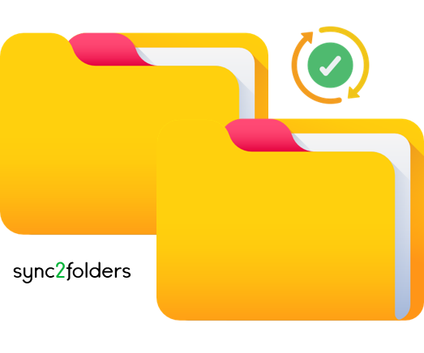

<a src='https://www.rplumber.io/'></a>

 
 
[](https://badge.fury.io/py/sync2folders)


<a href="mailto:ivan@atlasmga.com" rel="nofollow"></a>
<br>
<h1 style="text-align: left;">sync<span style="color: #00b336">2</span>folders</h1>

<p style="text-align: justify;">This is a simple program that synchronizes two folders: source and replica. The program maintains a full, identical copy of source folder at replica folder. The program is written in Python.</p>

<p style="text-align: justify;">The program is designed to be run from the command line. It takes three arguments: source folder path, replica folder path and synchronization interval. The program synchronizes the folders every time the interval expires. The program logs file creation/copying/removal operations to a file and to the console output.</p>

<br>

## Features

- [x] Synchronization is one-way: after the synchronization content of the replica folder is modified to exactly match content of the source folder;
- [x] Synchronization is performed periodically;
- [x] File creation/copying/removal operations are logged to a file and to the console output;
- [x] Folder paths, synchronization interval and log file path are provided using the command line arguments;

<br>

## Quick Start

Inside a folder of your choice, clone the repository from command line:

```bash
git clone https://github.com/ivanSantos16/sync2folders
```

You can run the program from the command line and ask for help with the script variables:

```bash
python sync2folders/synchronisation.py -h                                                                             usage: synchronisation.py [-h] -s SOURCE -r REPLICA -p PERIOD -l LOGS

Synchronizes two folders: source and replica

options:
  -h, --help            show this help message and exit
  -s SOURCE, --source SOURCE
                        Source folder path
  -r REPLICA, --replica REPLICA
                        Replica folder path
  -p PERIOD, --period PERIOD
                        Period of time in seconds between each synchronization
  -l LOGS, --logs LOGS  Logs file path
```

<br>

### Arguments Description
- `source` : Source folder path (required) [string]
- `replica` : Replica folder path (required) [string]
- `period` : Period of time in seconds between each synchronization (required) [int]
- `logs` : Logs file path (required) [string]

<br>

### Different examples of running the program.

First example:

```bash
python sync2folders.py <source_folder_path> <replica_folder_path> <sync_interval> <log_file_path>
```

```bash
python sync2folders.py source replica 10 logs/logs.txt
```
<br>

Second example:

```bash
python sync2folders.py -s <source_folder_path> -r <replica_folder_path> -p <sync_interval> -l <log_file_path>
```

```bash
python sync2folders.py -s source -r replica -p 10 -l logs/logs.txt
```
<br>

Third example:

```bash
python sync2folders.py --source <source_folder_path> --replica <replica_folder_path> --period <sync_interval> --logs <log_file_path>
```

```bash
python sync2folders.py --source source --replica replica --period 10 --logs logs/logs.txt
```
